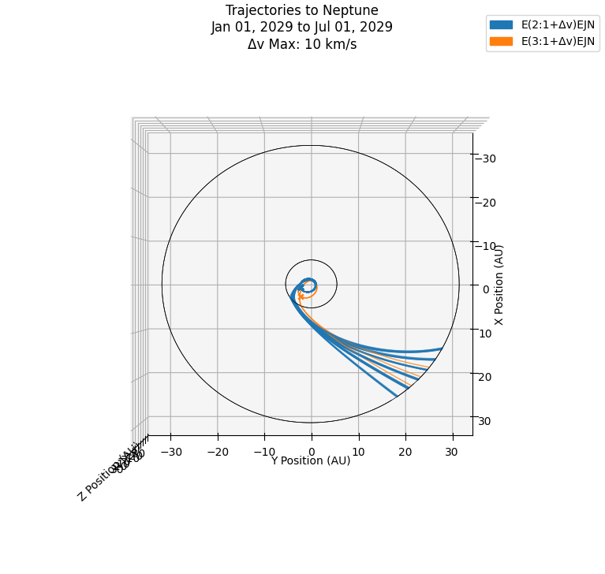

# Broad Trajectory Search w/ MCTS


## Usage

### Required Additional Files/Packages
#### Files
* de438.bsp

#### Packages
* Pykep
* Numpy
* Spiceypy
* Pandas
* Tabulate
* SciPy
### New Search
Import the MCTS object from the package & initialize. **For the time being, terminal path must be to /src folder**

```Python
from MCTS import MCTS

mcts = MCTS()

```

Set up trajectory constraintings that associate with desination and begin search

```Python
mcts.setup(
    '5',
    ["Jan 01, 2020", "Jan 01, 2023"],
    # Additional Constraints
)

mcts.run()
```

Runs on average take ~20 minutes per 10K iterations, and runs over 50K will not be able to be completely saved to spreadsheets or pickles

Results can be viewed with a variety of methods, from individual trajectories, to families, to state plots.

```Python
# Obtaining ID's that meet mission constraints
idList = mcts.getResults()

# Plotting highest valued result
mcts.plotPath(idList[0])

# Plotting top 50 families
mcts.plotFamilies(idList, showTop = 50)

# Plotting trajectory Launch C3 vs Time of Flight states with ranging Δv
mcts.plotAttributes(idList, 'C3', 'tof', 'dvTot')
```

Exporting results can be done 1 of 2 methods: straight to an excel spreadsheet (which cannot be reloaded) and to a pckl file (using Dill)

```Python
# Exporting full tree to Excel (for runs of 50K these files can reach 80 MB)
mcts.export(filename = "filename.xlsx", exportFullTree = True)

# Saving tree for later use (Not suggested for runs larger than 25K)
import dill
f = open('filename.pckl', 'wb')
dill.dump(mcts, f)
```

### Loading Previous Results

Import the dill & load pickle file. **For the time being, terminal path must be to /src folder**

```Python
# Import Package
import dill

# Open File
f = open("filename.pckl", "rb")

# Load File
mcts = dill.load(f)

# Reinstate Ephemeris Kernels
mcts.loadKernels()
```

The MCTS object is now ready to manipulate results as above